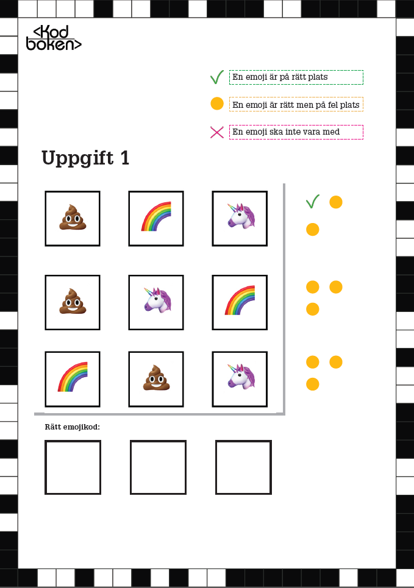

# Emojikoden

**Kan du knäcka koden och räkna ut vilka emojis som ska stå i vilken ordning?**

Denna lek är inspirerad av det gamla brädspelet Mastermind och går ut på att deltagarna ska försöka knäcka rätt kodrad med emojis genom uteslutningsmetoden. I en nedladdningsbar PDF nedan finns tre olika koduppgifter där deltagarna ska försöka lista ut rätt kodrad. Rita in de tre emojis i den ordning som ger det rätta svaret i de nedre tomma rutorna. Facit finns på sista sidan.

De tre färgade symbolerna till höger om vardera emoji-kodrad (bock, cirkel och kryss) ger ledtrådar för hur många emojis i vardera rad som är rätt och om de ligger i rätt ordning. Det gäller alltså att lista ut vilka emojis som ska vara med i kodraden och i vilken ordning de ska placeras!

## Material att ladda ned och skriva ut

* [Ladda ned Emojikoden (inkl facit) som PDF](https://github.com/Kodcentrum/Datorfria-lekar/raw/master/lek_kodknackaren/Kodcentrum_Emojikoden.pdf)

## Instruktioner för handledare

**Tidsåtgång: Ca 10-20 min**

Dela in deltagarna i mindre grupper eller låt dem jobba parvis. 

1. Dela ut den utskrivna pdf:en med Emojikoden - tre uppgifter. Notera att PDF måste skrivas ut i färg samt dubbelsidigt- Göm undan den sista sidan som är facit. 
3. Ge deltagarna ett problem i taget att lösa. Förklara uppgiften och vad de färgade symbolern betyder. 
4. När deltagarna tror att de kommit fram till rätt kod – ge dem inte svaret direkt. Gå igenom koden och "testa" den mot de olika svarsalternativen för att se om deras kod fungerar, så att ni tillsammans kommer fram till om det är rätt kod eller om ni behöver hitta en annan lösning tillsammans.
